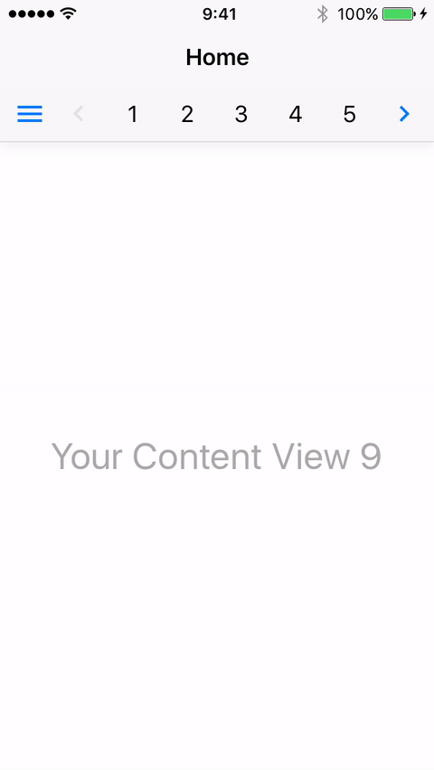

# AZTabBar
A Tab Bar that does not require a swipe gesture to navigate

##Screenshots


##Installation

Simply drag and drop the ```AZTabBar``` folder to your project.

##Usage

Implement the delegate and the data source protocols:
```swift
class ViewController: UIViewController,AZTabBarDelegate,AZTabBarDataSource {

    /**Required Data Source Methods**/
     
    /*
     * Returns the amount of items inside the tab.
     */
    func numberOfItemsInTabBar(_ tabBarController: AZTabBarController) -> Int

    /*
     * The UIView per index that will be inside the tab.
     */
    func stickerTabBar(_ tabBarController: AZTabBarController, tabViewForPageAtIndex index: Int) -> UIView
    
    /*
     * contentView:UIView - is the content that will be presented inside the content holder.
     * controller:UIViewController - is the UIViewController that holds the content view (if exists).
     */
    func stickerTabBar(_ tabBarController: AZTabBarController, contentViewForPageAtIndex index: Int) -> ( contentView:UIView,controller:UIViewController?)
    
    /*
     * A Custom menu view
     */
    func stickerTabBar(_ tabBarController: AZTabBarController, menuViewForIndex index:Int) -> (view:UIView?,icon:UIImage?,title:String?)
    
    
    /**Optional Delegate Methods**/
    
    /*
     * Triggered when clicking the menu button.
     */
     func stickerTabBar(_ tabBarController: AZTabBarController, didSelectMenu menu:UIView, at index:Int)
    
    /*
     * Triggered when closing the custom menu
     */
     func stickerTabBar(_ tabBarController: AZTabBarController, didCloseMenu menu:UIView, at index:Int)
    
    /*
     * Triggered when navigating between pages.
     */
     func stickerTabBar(_ tabBarController: AZTabBarController, didChangeToPage index:Int ,from oldPage:Int)
    
    /*
     * Triggered when changing to a new item.
     */
     func stickerTabBar(_ tabBarController: AZTabBarController, didChangeToItem index:Int)
}
```

Now the controller initialize:

```swift
        let tabBarController = AZTabBarController.standardController()
```

Set the delegate and the data source:
```swift
        tabBarController.delegate = self
        tabBarController.dataSource = self
        //Do any additianl customizations
```

Add it as a child view controller:
```swift
        addChildViewController(tabBarController)
```

And finally add the sub view:

```swift
        tabBarController.view.frame = self.view.frame
        self.view.addSubview(tabBarController.view)
```


Extra Customizations


```swift
        //start with index
        tabBarController.currentIndex = 7
        
        //Control settings
        tabBarController.isPagingEnabled = true
        tabBarController.isScrollEnabled = true
        
        //UI Settings
        
        //seperator
        tabBarController.sepratorColor = UIColor.gray
        tabBarController.showSeperator = true
        tabBarController.allowSeperatorShadow = false
        tabBarController.seperatorHeight = 2
        
        //arrow controls
        tabBarController.arrowColor = UIColor.green
        tabBarController.arrowBackgroundColor = UIColor.clear
        
        //tab bar
        tabBarController.tabBackgroundColor = UIColor(red: (247.0 / 255.0), green: (247.0 / 255.0), blue: (247.0 / 255.0), alpha: 1)
        
        //menu button
        tabBarController.menuIconColor = UIColor.orange
        tabBarController.menuBackgroundColor = UIColor.clear
        
        //collection cell highlight color
        tabBarController.highlightedItemColor = UIColor.blue
        
        
        //custom menu view
        tabBarController.isCustomMenuEnabled = true
        tabBarController.isMenuViewHidden = true

```
Checkout the [Resources.swift](https://github.com/Minitour/AZTabBar/blob/master/AZTabBar/Source/Resources.swift) file for more options.
